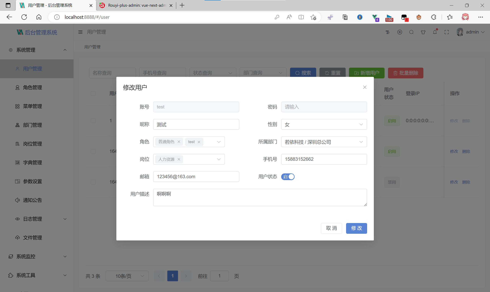
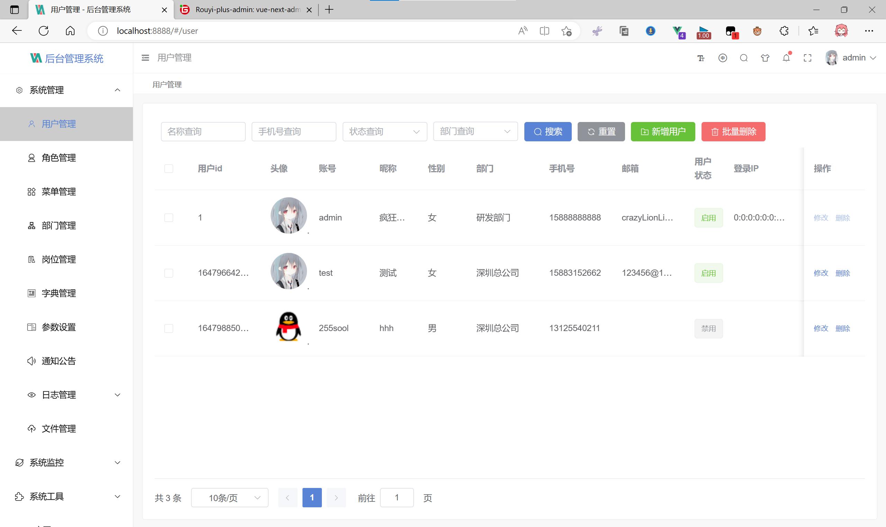
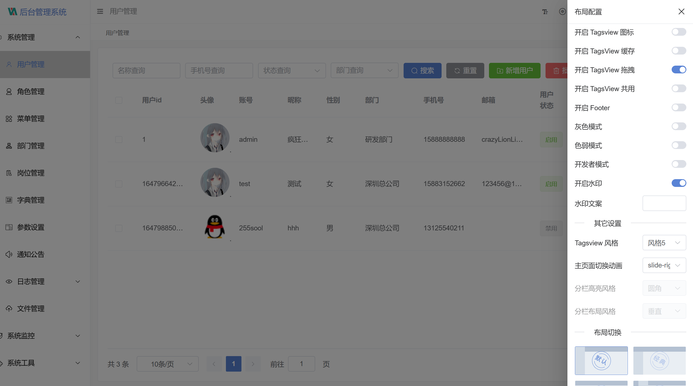

<div style="height: 10px; clear: both;"></div>

- - -
## 平台简介

# 本框架为Rouyi-Vue-Plus第三方扩展的前端项目

基于 vue3.x + CompositionAPI setup 语法糖 + typescript + vite + element plus + vue-router-next + pinia 技术，适配手机、平板、pc 的后台开源免费模板，希望减少工作量，帮助大家实现快速开发。

#### 🚧 安装 cnpm、yarn

- 复制代码(桌面 cmd 运行) `npm install -g cnpm --registry=https://registry.npm.taobao.org`
- 复制代码(桌面 cmd 运行) `npm install -g yarn`

#### 🏭 环境支持

| Edge      | Firefox      | Chrome      | Safari      |
| --------- | ------------ | ----------- | ----------- |
| Edge ≥ 88 | Firefox ≥ 78 | Chrome ≥ 87 | Safari ≥ 13 |

> 由于 Vue3 不再支持 IE11，故而 ElementPlus 也不支持 IE11 及之前版本。

#### ⚡ 使用说明

建议使用 cnpm，因为 yarn 有时会报错。<a href="http://nodejs.cn/" target="_blank">node 版本 > 14.18+/16+</a>

> Vite 不再支持 Node 12 / 13 / 15，因为上述版本已经进入了 EOL 阶段。现在你必须使用 Node 14.18+ / 16+ 版本。

```bash
# 克隆项目
git clone https://gitee.com/lyt-top/vue-next-admin.git

# 进入项目
cd vue-next-admin

# 安装依赖
cnpm install

# 运行项目
cnpm run dev

# 打包发布
cnpm run build
```

#### 📚 开发文档

- 查看前端开发文档：<a href="https://lyt-top.gitee.io/vue-next-admin-doc-preview" target="_blank">vue-next-admin-doc</a>
- 后端开发文档：<a href="https://gitee.com/dromara/RuoYi-Vue-Plus/wikis/pages" target="_blank">Rouyi-Vue-Plus</a>

## ⚡差异说明

前端路由参数：

```
 * meta: {
 *      title:          菜单栏及 tagsView 栏、菜单搜索名称（国际化）
 *      link：        	是否超链接菜单，开启外链条件，`1、link: 链接地址不为空 2、isIframe:false`
 *      isHide：        是否隐藏此路由
 *      noCache：       是否缓存组件状态
 *      isAffix：       是否固定在 tagsView 栏上，默认 false
 *      isIframe：      是否内嵌窗口，开启条件，`1、isIframe:true 2、link：链接地址不为空`
 *      roles：         当前路由权限标识，取角色管理。若为空数组则无权限控制
 *      icon：          菜单、tagsView 图标，阿里：加 `iconfont xxx`，fontawesome：加 `fa xxx`
 * }
```

需要添加sys_menu数据库字段：

```sql
is_affix` enum('0','1') CHARACTER SET utf8mb4 COLLATE utf8mb4_0900_ai_ci DEFAULT '1' COMMENT '是否固定在 tagsView 栏上，（0是 1否）',
is_iframe` enum('0','1') CHARACTER SET utf8mb4 COLLATE utf8mb4_0900_ai_ci DEFAULT '1' COMMENT '是否内嵌窗口（0是 1否）
```

com.ruoyi.common.core.domain.entity.SysMenu.java 

需要在这个文件里面添加两个字段

```java
    /**
     *  是否固定在标签栏
     */
    private String isAffix;
    /**
     *  是否内嵌窗口
     */
    private String isIframe;
```

com.ruoyi.system.domain.vo.MetaVo

需要在这个文件里面增加两个字段

```java
package com.ruoyi.system.domain.vo;
import com.ruoyi.common.utils.StringUtils;
import lombok.Data;
/**
 * 路由显示信息
 *
 * @author ruoyi
 */

@Data
public class MetaVo {
    /**
     * 设置该路由在侧边栏和面包屑中展示的名字
     */
    private String title;

    /**
     * 设置该路由的图标，对应路径src/assets/icons/svg
     */
    private String icon;

    /**
     * 设置为true，则不会被 <keep-alive>缓存
     */
    private boolean noCache;

    /**
     * 内链地址（http(s)://开头）
     */
    private String link;

    /**
     *  是否固定在标签栏
     */
    private Boolean isAffix;
    /**
     *  是否隐藏路由，当设置 true 的时候该路由不会再侧边栏出现
     */
    private Boolean isHide;

    /**
     *  是否内嵌窗口
     */
    private Boolean isIframe;

    public MetaVo(String title, String icon) {
        this.title = title;
        this.icon = icon;
    }
    public MetaVo(String title, String icon, boolean noCache) {
        this.title = title;
        this.icon = icon;
        this.noCache = noCache;
    }
    public MetaVo(String title, String icon, String link) {
        this.title = title;
        this.icon = icon;
        this.link = link;
    }
    public MetaVo(String title, String icon, boolean noCache, String link,boolean isHide,Boolean isIframe,Boolean isAffix) {
        this.title = title;
        this.icon = icon;
        this.noCache = noCache;
        if (StringUtils.ishttp(link)) {
            this.link = link;
        }
        this.isHide = isHide;
        this.isIframe = isIframe;
        this.isAffix = isAffix;
    }
}
```

com.ruoyi.system.service.impl.SysMenuServiceImpl

需要在这个文件里面覆盖以下方法

```java
   /**
     * 构建前端路由所需要的菜单
     *
     * @param menus 菜单列表
     * @return 路由列表
     */
    @Override
    public List<RouterVo> buildMenus(List<SysMenu> menus) {
        List<RouterVo> routers = new LinkedList<>();
        for (SysMenu menu : menus) {
            RouterVo router = new RouterVo();
            router.setHidden("1".equals(menu.getVisible()));
            router.setName(getRouteName(menu));
            router.setPath(getRouterPath(menu));
            router.setComponent(getComponent(menu));
            router.setQuery(menu.getQueryParam());
            router.setMeta(new MetaVo(
                menu.getMenuName(),
                menu.getIcon(),
                StringUtils.equals("0", menu.getIsCache()),
                menu.getPath(),
                StringUtils.equals("1", menu.getVisible()),
                StringUtils.equals("0", menu.getIsIframe()),
                StringUtils.equals("0", menu.getIsAffix())));
            List<SysMenu> cMenus = menu.getChildren();
            if (CollUtil.isNotEmpty(cMenus) && UserConstants.TYPE_DIR.equals(menu.getMenuType())) {
                router.setAlwaysShow(true);
                router.setRedirect("noRedirect");
                router.setChildren(buildMenus(cMenus));
            } else if (isMenuFrame(menu)) {
                router.setMeta(null);
                List<RouterVo> childrenList = new ArrayList<>();
                RouterVo children = new RouterVo();
                children.setPath(menu.getPath());
                children.setComponent(menu.getComponent());
                children.setName(StringUtils.capitalize(menu.getPath()));
                children.setMeta(new MetaVo(
                    menu.getMenuName(),
                    menu.getIcon(),
                    StringUtils.equals("0", menu.getIsCache()),
                    menu.getPath(),
                    StringUtils.equals("1", menu.getVisible()),
                    StringUtils.equals("0", menu.getIsIframe()),
                    StringUtils.equals("0", menu.getIsAffix())));
                children.setQuery(menu.getQueryParam());
                childrenList.add(children);
                router.setChildren(childrenList);
            } else if (menu.getParentId().intValue() == 0 && isInnerLink(menu)) {
                router.setMeta(new MetaVo(menu.getMenuName(), menu.getIcon()));
                router.setPath("/");
                List<RouterVo> childrenList = new ArrayList<>();
                RouterVo children = new RouterVo();
                String routerPath = innerLinkReplaceEach(menu.getPath());
                children.setPath(routerPath);
                children.setComponent(UserConstants.INNER_LINK);
                children.setName(StringUtils.capitalize(routerPath));
                children.setMeta(new MetaVo(menu.getMenuName(), menu.getIcon(), menu.getPath()));
                childrenList.add(children);
                router.setChildren(childrenList);
            }
            routers.add(router);
        }
        return routers;
    }

```

#### 💯 学习交流加 QQ 群

> 群号：214208060


# 演示图：






